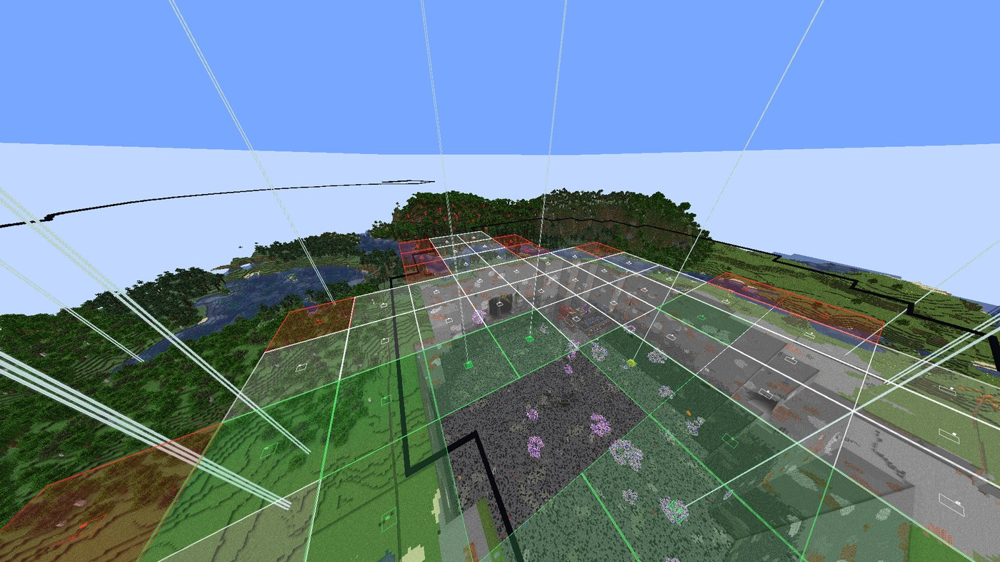
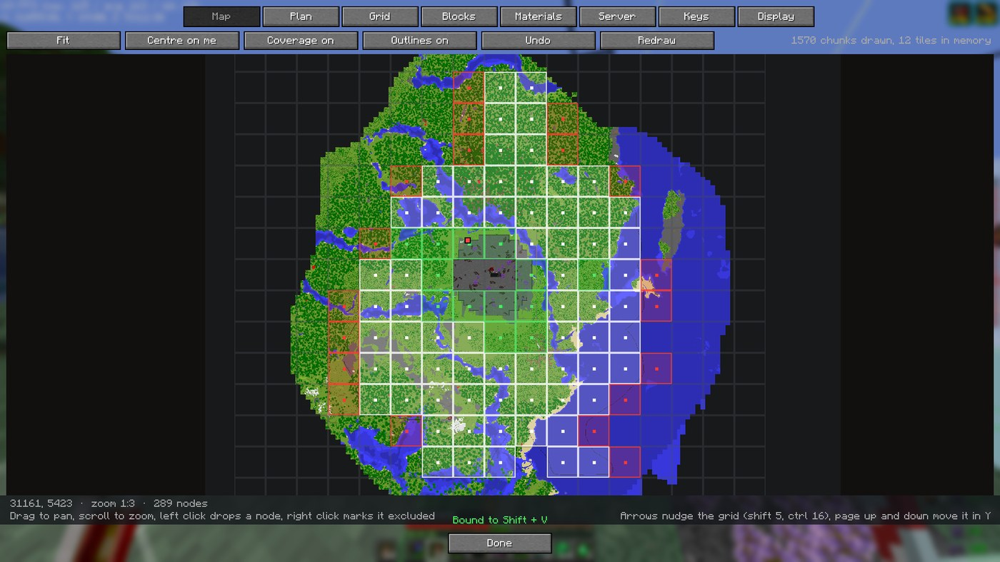
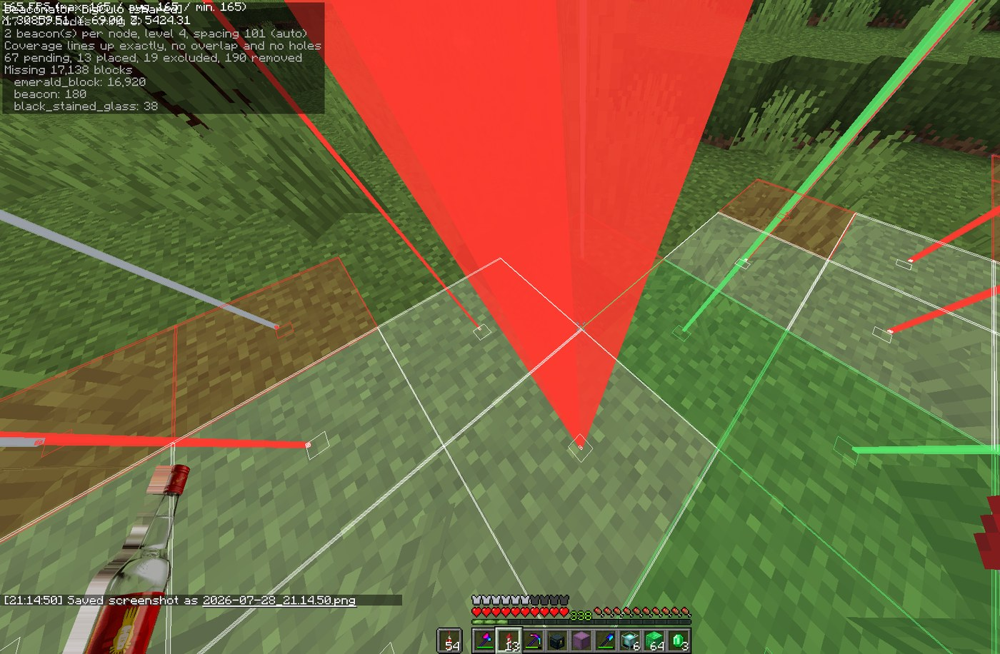

# Beaconator

[](https://github.com/CodeW4VE/Beaconator/actions/workflows/build.yml)
[](LICENSE)
[](https://fabricmc.net/)

A Fabric mod for planning and building **beacon perimeters**. Client side on its own; put the
same jar on the server and the whole team shares one plan.

Drop one beacon in the middle, scroll to grow the grid, and Beaconator works out where every
other beacon goes, draws exactly how much ground each one covers, and keeps track of which ones
you have already built.



[Español](README_es.md)

## Why

Schematic mods do the job, but for this one task they get in the way:

- Every schematic block is highlighted, air and dirt included, which is noise you have to look past.
- Nothing shows the area a beacon actually covers, so you find the holes in your perimeter by walking into them.
- Telling apart what is built from what is not means comparing against the schematic by eye.

Beaconator only does perimeters, so it can do them properly.

## What it does

- **A map you can plan on.** The mod draws its own map, one pixel per block, from the chunks you load as you play, and puts the whole grid on top of it. You decide which nodes are in, which are out and which get dropped by clicking on them. That is how a perimeter actually gets planned: looking down at the shape, not squinting at boxes from the ground a hundred blocks away. Tiles are cached on disk, so what you have flown over stays drawn.
- **Grid from one point.** Place the centre, scroll to step through concentric rings: 1 node, 9, 25, 49. Sides can be grown on their own when the perimeter is not square.
- **Real coverage volumes.** Each node is drawn as the volume vanilla actually applies effects in. That is `2r + 1` blocks wide, `r` blocks down, and unbounded upwards, not a cube.
- **1 to 5 beacons per node** on one shared pyramid, so you can run every primary effect at once. The layer sizes and block counts are worked out for you.
- **Node states.** Left click drops a node from the plan, right click marks it as outside the perimeter, which puts a black stained glass on top so it reads as "not one of ours" from far away.
- **Live scan.** Nodes turn green on their own as you build them, and half built pyramids shade towards green as their blocks go in.
- **Material list** of what the plan needs and what is still missing.
- **Assisted placement** that picks the right block out of your hotbar and refuses to let you put plan blocks where the plan wants none.
- **Layer filter** to work one course at a time.
- **Litematica import and export**, so you can pick up a perimeter you already built and hand the schematic to people who do not run this mod. If Litematica is installed, easy place follows its toggle instead of fighting it.
- **A plan shared by the server.** Drop the jar on a Fabric server and one plan belongs to
  everyone: it arrives when you join, and every node anyone places, excludes or drops shows up
  live for the rest. Publishing it is an operator's call, marking nodes is anybody's. Without the
  mod on the server nothing changes, and a vanilla client is never sent anything.
- **English and Spanish**, switched from the screen rather than from the game language.
- **Every key rebindable** from the mod's own Keys tab, and the screen opens from Mod Menu too.

## Requirements

- Minecraft **1.21** through **1.21.8**, and **1.21.11**, one jar per version
- Fabric Loader 0.16 or newer
- [Fabric API](https://modrinth.com/mod/fabric-api)

Drop the jar in `mods/` and start the game. That is the whole install.

Optional, and only if you want the whole team on one plan: put **the same jar** on the Fabric
server as well. Without it the mod still works, you just keep your plan to yourself.

## Never used it before? Start here

Beaconator is for one job: covering a large area in beacons, evenly, without holes, and knowing
what you have left to build. If you are spawn proofing a perimeter, this is the mod.

**1. Open the screen.** Press **Shift + B**. That is the whole interface: tabs across the top,
Done at the bottom. `B` on its own turns edit mode on and off.

**2. Make a plan.** Stand roughly in the middle of the area and, on the **Plan** tab, press
**New plan here**. If the perimeter is already half built, press **Detect from world** instead
and the mod reads the beacons that are already there, with their real coordinates.

**3. Shape it on the map.** The **Map** tab is the mod's own map, drawn one pixel per block from
the chunks you have loaded, with your grid on top of it.



Getting around it:

| Input | What it does |
|-------|--------------|
| Drag | Move the map |
| Scroll | Zoom in and out |
| **Fit** button | Zoom out until the whole plan is on screen |
| **Centre on me** button | Jump to where you are standing |
| Left click a node | Drop it from the plan (it is not built at all) |
| Right click a node | Mark it excluded (built, but not part of the perimeter) |
| Shift + drag, left | Drop everything in the rectangle |
| Shift + drag, right | Exclude everything in the rectangle |
| Ctrl + drag | Put the rectangle back to pending |
| Ctrl + Z, or **Undo** | Undo the last change, one node or a whole rectangle |
| Arrow keys | Nudge the whole grid a block (shift 5, ctrl 16) |
| Page up / down | Move the grid in Y |

Nothing is lost by closing the screen: the plan saves itself, and reopens on its own next time
you join that server.

**4. Set it up.** On the **Grid** tab: how many beacons per node, the pyramid level, the spacing,
and how far the grid reaches. Leave **Spacing follows level** on and the coverage lines up
exactly, with no overlap and no holes. The line under the buttons tells you if it does.

**5. Build it.** Now go dig. In the world you get:

- A **beam on every beacon position** that runs to the sky like a real beacon. **Red** means it
  is not built, **yellow** means it is started but not finished (including a pyramid that is up
  but missing a beacon), **green** means done, grey means excluded. Press **G** to turn the beams
  off when they are in the way.

  

- The **coverage** each beacon actually gives, so holes are visible instead of theoretical.
- A **material list** of what is left, in the HUD and on the Materials tab.
- Nodes turn green **on their own** as you build them. You do not tell the mod anything.

**6. Working as a team.** If the server has the mod, a **Server** tab appears. Press
**Share mine** to put your plan up there; everyone else presses its name to open it. From then on
every node anyone finishes shows up for the rest, live. The HUD says `[shared]` when what you
mark is going out to everyone.

## Keys

Every binding is rebindable, from the game's controls screen or from the mod's **Keys** tab.
Bindings can take modifiers, so `G`, `Shift + G` and `Ctrl + Shift + G` are three different
things.

| Binding | Default |
|---------|---------|
| Edit mode | `B` |
| Open the screen | `Shift + B` |
| Beams on and off | `G` |
| Set the centre where you stand | unbound |
| Render on and off | unbound |
| Easy place on and off | unbound |
| Layer up · Layer down | unbound |
| Scan the world | unbound |
| Undo | unbound |

With edit mode on, in the world:

| Input | What it does |
|-------|--------------|
| Scroll | Grow or shrink the grid |
| Shift + scroll | Beacons per node, 1 to 6 |
| Ctrl + scroll | Nudge the spacing |
| Left click a node | Drop it from the plan, or put it back |
| Right click a node | Mark it excluded, or put it back |

## Commands

Three, because everything else is a button that also shows you its current value, which a command
cannot do.

| Command | What it does |
|---------|--------------|
| `/bea` or `/bea gui` | Open the screen |
| `/bea share` | Put the open plan on the server |

## The geometry, if you are curious

A beacon with `level` pyramid layers reaches `10 * level + 10` blocks, so a full level 4 pyramid
covers a square `101` blocks a side. Set the spacing to that and coverage lines up exactly with
no overlap and no holes. Anything wider leaves strips of ground with no effect, which Beaconator
paints red so you notice before you are standing in one.

Beacons on one shared pyramid make layer `k` into `(2k + a)` by `(2k + b)`, where `a x b` is the
rectangle the beacons sit in. The shape matters: four beacons in a row need 236 blocks a node,
four in a square need 216, and across a few hundred nodes that is thousands of blocks. Beaconator
costs every rectangle that fits your beacons and uses the cheapest.

A curiosity that falls out of it: five and six beacons cost the same pyramid, since both live in
a 2x3. There are only five primary effects, so the sixth is a spare that comes free.

The maths lives in `xyz.w4ve.beaconator.model`, has no Minecraft in it, and is covered by unit
tests against a real 208 node perimeter.

## Building

```
JAVA_HOME=/path/to/jdk-21 ./gradlew build
```

The jar lands in `build/libs/`.

## Licence

MIT. Behaviour was taken as inspiration from the schematic and info HUD mods everyone uses, but
no code was copied from any of them.
